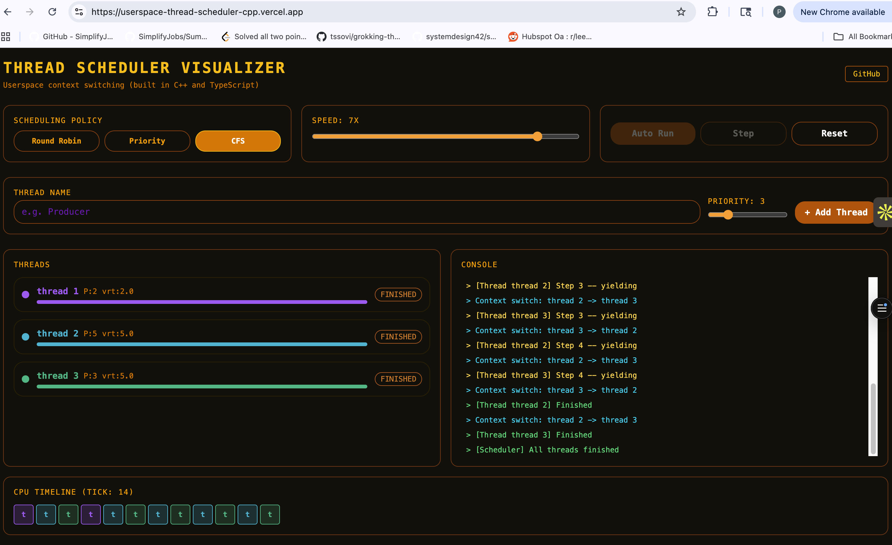

# Userspace Thread Scheduler (C++)

I built this because I wanted to understand what actually happens during a context switch, not just "the OS saves state and switches threads," but the real mechanics at the CPU level.

Turns out you can implement a working thread scheduler entirely in userspace using `ucontext_t`. No kernel involvement, no pthreads. Just raw context manipulation.

🔗 **Live Demo: [userspace-thread-scheduler-cpp.vercel.app](https://userspace-thread-scheduler-cpp.vercel.app/)**

---

## What it does

Implements a full thread scheduler from scratch in C++:

- Creates threads with their own stack memory and execution context
- Switches between threads by saving and restoring CPU state (registers, stack pointer, program counter)
- Supports three scheduling policies: Round Robin, Priority, and CFS-inspired
- Includes Mutex and Semaphore primitives built on top of the scheduler
- Demonstrates producer-consumer with proper synchronization

The visualizer lets you create threads dynamically, choose a scheduling policy, and step through execution to watch context switches happen in real time.

---

## How context switching works

Each thread gets a `TCB` (Thread Control Block) that holds everything needed to resume it: its saved CPU context via `ucontext_t`, its own stack memory (1MB), current state, priority, and vruntime.

When a thread calls `yield()`, we call `swapcontext()`, which atomically saves the current thread's registers/SP/PC into its TCB and loads the next thread's saved state. The CPU jumps directly to wherever that thread was last paused. Neither thread knows the other exists.

This is exactly what the Linux kernel does, just without the hardware timer interrupt for preemption.

---

## Scheduling policies

**Round Robin** is the default; each thread gets equal time in order. Simple and fair.

**Priority** always runs the highest priority thread first. Works well when some tasks genuinely matter more, but low-priority threads can starve if high-priority ones never finish.

**CFS-inspired** tracks how much CPU time each thread has consumed (`vruntime`) and always picks the thread with the least. This is roughly what Linux's Completely Fair Scheduler does: it tries to give every thread equal CPU time over the long run, regardless of when they were created or how often they yield.

---

## Synchronization

The Mutex and Semaphore implementations use the scheduler's blocking mechanism rather than busy-waiting. When a thread can't acquire a lock, it gets moved to a `waitQueue` and removed from the run queue entirely, so it consumes zero CPU until the lock is released. This is the difference between blocking and spinning.

---

## Building and running

Requires g++ with C++17. Works on macOS and Linux.

    make        # compile
    make run    # run all three demos
    make clean  # remove build artifacts

---

## Project structure

    include/       TCB, Scheduler, Mutex/Semaphore headers
    src/           implementations
    tests/         Round Robin, Priority, and producer-consumer demos
    visualizer/    React + TypeScript interactive UI
    docs/          notes and screenshots

---

## What I learned

The `ucontext_t` API is deprecated on macOS but still works fine, Apple just wants everyone using pthreads. Using it directly gave me a much clearer picture of what pthreads abstracts away.

The trickiest part was getting `threadFinished()` right. When a thread's function returns, you can't just let execution fall off the end you need to call back into the scheduler to pick the next thread. The solution is a wrapper function (`threadEntry`) that calls the real function and then immediately calls `threadFinished()`. Every thread actually runs `threadEntry`, which calls the user's function internally.

---

## Tech

C++17, POSIX ucontext API, React, TypeScript, Vite, Tailwind, Vercel
